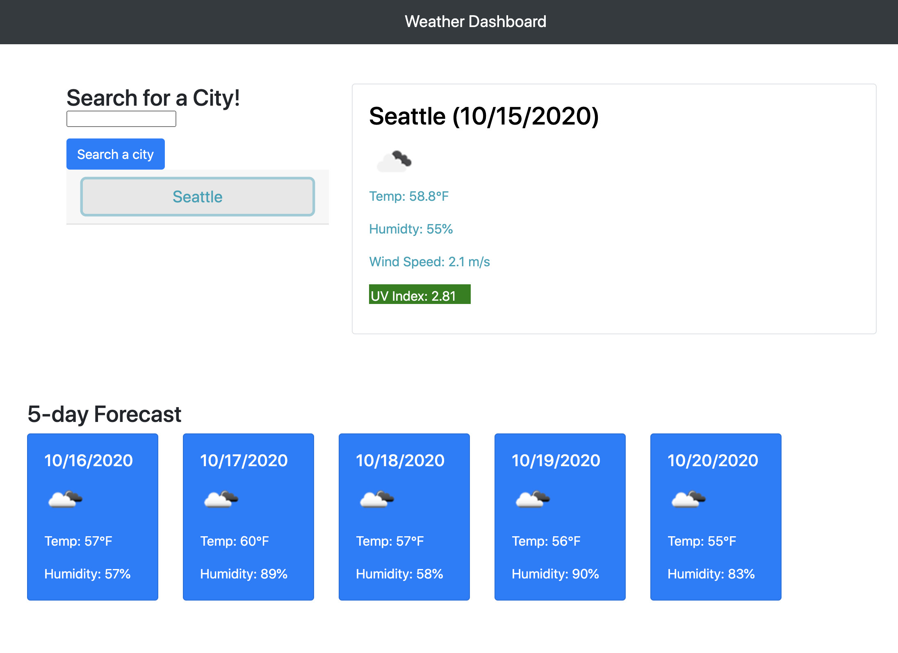
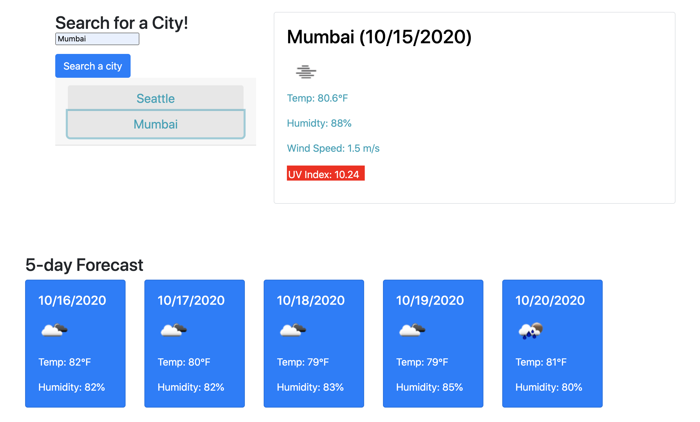
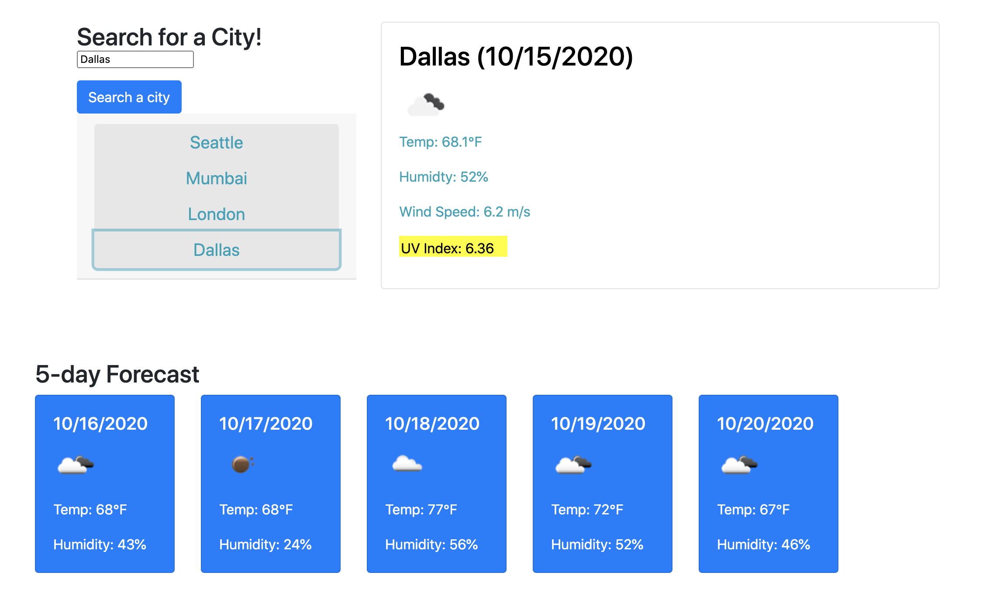

# 06 Server-Side APIs: Weather Dashboard


Explore the [Deployed Weather Forecast](https://suzylebel.github.io/Weather-Forecast/)
View the [Github page](https://github.com/suzylebel/Weather-Forecast)


## Table of Contents
1. [User story](#User-story)
2. [About the Project](#About-the-Project)
3. [Tech/Framework used](#Tech-Used)
4. [Code Breakdown](Code-Breakdown)
5. [UI](#UI)
6. [License](#License)
7. [Contact](#Contact)
8. [Credits](#Credit)

## User Story

```
AS A traveler
I WANT to see the weather outlook for multiple cities
SO THAT I can plan a trip accordingly
```


## About the Project

Explore the [Deployed Weather Forecast](https://suzylebel.github.io/Weather-Forecast/)

The goal of this project was to edit files that were already given to us and use JQuery to create a functioning Day planner for our user to use. Using moment.js we were also able to color code the planner based on the users current time to show past, present and future! Local storage was also used so the users Planner is saved!

Here is an image of what the project looks like: 



## Tech Used
JQuery and Ajax calls for API's. This application used the open weather app. 

## Code Breakdown

As noticed in the photos below: the cities stack on the side in a container of the own and depending on the UV Index of the city the color changes as it is considered: Normal, moderate, or a danger index. 







```

                    if (uvI < (3.00)) {
                        uvEl.attr("id", "green")
                    }

                    else if (uvI > 3 && uvI < 8) {
                        uvEl.attr("id", "yellow")
                    }

                    else {
                        uvEl.attr("id", "red")
                    }
```
By creating an else if statement the colors change in the style sheet based on its new "id."


This is the .ajax call that was used to get the lat and lon to use for 5 day forecast call. 
```
 var APIkey = "&appid=3ab769e1d5edf7b37431bdd5400d6c70"
            var queryURL = "https://api.openweathermap.org/data/2.5/weather?q=" + city + APIkey;


            $.ajax({
                url: queryURL,
                method: "GET"
            }).then(function (response) {
                // $("#cities-view").text(JSON.stringify(response));
                console.log(response);
                        
 ```      

I also needed to use a for loop to get the information for the 5 day forecast cards! 
This was confusing at first, but I was able to simplify it to itterate every 8 times that represented a "new day forecast" at 6 pm each day.

 ```
  for (let i = 0; i < response.list.length; i+= 8) {
                  
                        
                        forecastTemp.push(response.list[i].main.temp);
                        forecastHumidity.push(response.list[i].main.humidity);
                        forecastIcon.push(response.list[i].weather[0].icon);
                    // }


 ```


## UI
The UI is similar to what was requested for the application image. 

## Contribute
If you’d like to fork this project from github please feel free! With a pull request I can grant you access to leave comments and notes about this project. 

## License 
None
 
## Contact 

Suzy Le Bel 
suzy.lebel@gmail.com

Project Link can be found [here.](https://suzylebel.github.io/Weather-Forecast/)

## Credit
Assistance from Amanda Crawford (BCS Tutor). 


